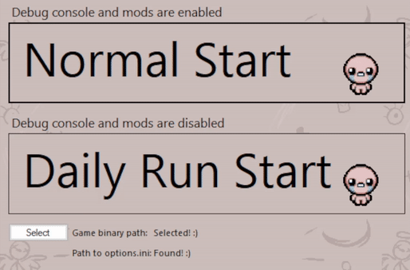

# Isaac Launcher

  

  <b>For those, who play with debug console enabled but also want to play daily runs and are tired of always changing EnableDebugConsole option manually</b>

## How it works:

  

**Basically, it's just changing values in options.ini for you and then launch game directly**

**Steps:**
1. Launch Program
1. Click "Select" button
1. Find your game binary (isaac-ng.exe)
1. Click one of the start buttons
1. Enjoy!

NOTE: You can find your options backup located in data folder every time you launch game using Isaac Launcher.
